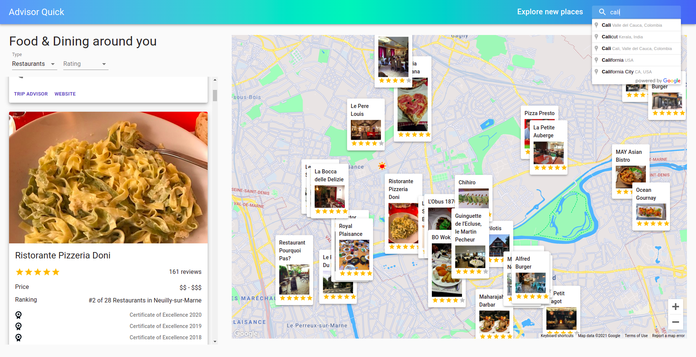
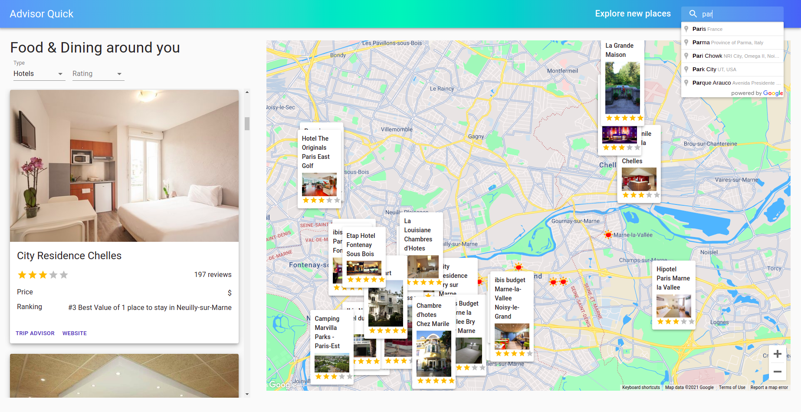
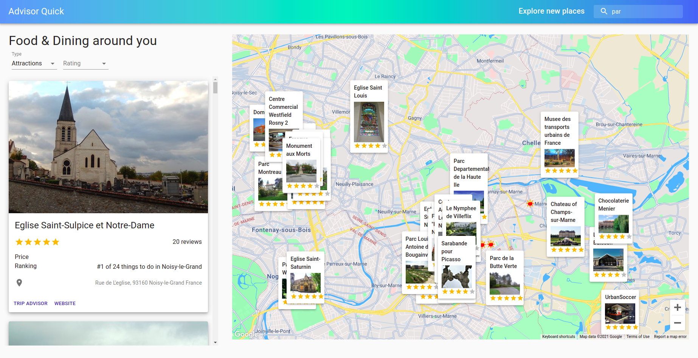

# Quick Advisor

### [Live Site](https://quick-advisor.netlify.app/)


<div style="width:100%">
    <div style="width:50%; display:inline-block">
        <div style="flexWrap: wrap; justify-content: center ; margin-left: 10; margin-right: 10">
             
                
              
        </div>    
    </div>    
</div>

## Introduction
Build and Deploy an advanced Travel Companion Application using Google Maps. With Geolocation, Google Maps API, Searching for places, Fetching restaurants, hotels and attractions based on location from specialized Rapid APIs, data filtering and much more.

# you can search for:
- Restaurants
- Hotels
- Attractions all round the world.


In this project, you'll learn:

- Advanced React Best Practices such as folder & file structure, hooks and refs
- Creating a User Interface using Material UI
- Working with Google Maps API
- And most importantly fetching data from unlimited sources using RapidAPI
- Essentially, you'll become the master of working with APIs

[RapidAPI](https://rapidapi.com)
[Travel Advisor API](https://rapidapi.com/apidojo/api/travel-advisor)
[Open Weather Map API](https://rapidapi.com/community/api/open-weather-map)


Setup: run ```npm i && npm start``` to start the development server

